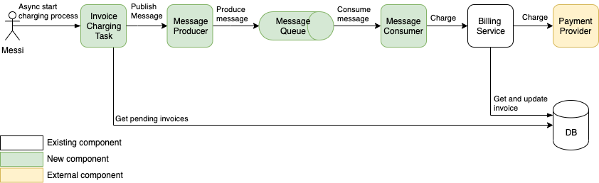

## Antaeus

Antaeus (/ænˈtiːəs/), in Greek mythology, a giant of Libya, the son of the sea god Poseidon and the Earth goddess Gaia. He compelled all strangers who were passing through the country to wrestle with him. Whenever Antaeus touched the Earth (his mother), his strength was renewed, so that even if thrown to the ground, he was invincible. Heracles, in combat with him, discovered the source of his strength and, lifting him up from Earth, crushed him to death.

Welcome to our challenge.

## The challenge

As most "Software as a Service" (SaaS) companies, Pleo needs to charge a subscription fee every month. Our database contains a few invoices for the different markets in which we operate. Your task is to build the logic that will schedule payment of those invoices on the first of the month. While this may seem simple, there is space for some decisions to be taken and you will be expected to justify them.

## Instructions

Fork this repo with your solution. Ideally, we'd like to see your progression through commits, and don't forget to update the README.md to explain your thought process.

Please let us know how long the challenge takes you. We're not looking for how speedy or lengthy you are. It's just really to give us a clearer idea of what you've produced in the time you decided to take. Feel free to go as big or as small as you want.

## Developing

Requirements:
- \>= Java 11 environment

Open the project using your favorite text editor. If you are using IntelliJ, you can open the `build.gradle.kts` file and it is gonna setup the project in the IDE for you.

### Building

```
./gradlew build
```

### Running

There are 2 options for running Anteus. You either need libsqlite3 & rabbitmq or docker. Docker is easier but requires some docker knowledge. We do recommend docker though.

*Running Natively*

Native java with sqlite (requires libsqlite3):
If you use homebrew on MacOS `brew install sqlite`.

Messaging system (requires rabbitmq):
If you use homebrew on MacOS `brew install rabbitmq`.

```
./gradlew run
```

*Running through docker*

Install docker for your platform. Execute the below command to build & start application. 

```
docker-compose up
```

### App Structure
The code given is structured as follows. Feel free however to modify the structure to fit your needs.
```
├── buildSrc
|  | gradle build scripts and project wide dependency declarations
|  └ src/main/kotlin/utils.kt 
|      Dependencies
|
├── pleo-antaeus-app
|       main() & initialization
|
├── pleo-antaeus-core
|       This is probably where you will introduce most of your new code.
|       Pay attention to the PaymentProvider and BillingService class.
|
├── pleo-antaeus-data
|       Module interfacing with the database. Contains the database 
|       models, mappings and access layer.
|
├── pleo-antaeus-models
|       Definition of the Internal and API models used throughout the
|       application.
|
└── pleo-antaeus-rest
        Entry point for HTTP REST API. This is where the routes are defined.
```

### Main Libraries and dependencies
* [Exposed](https://github.com/JetBrains/Exposed) - DSL for type-safe SQL
* [Javalin](https://javalin.io/) - Simple web framework (for REST)
* [kotlin-logging](https://github.com/MicroUtils/kotlin-logging) - Simple logging framework for Kotlin
* [JUnit 5](https://junit.org/junit5/) - Testing framework
* [Mockk](https://mockk.io/) - Mocking library
* [Sqlite3](https://sqlite.org/index.html) - Database storage engine

Happy hacking 😁!

## Charge Customer Feature

### Solution

Create an asynchronous API that can be triggered manually or using a scheduler. This API will retrieve all pending invoices, and send the ids of invoices to a queue which will then be consumed, and processed by the billing service.

The solution that I came up with involves adding some new components & logic to the system to solve several problems:
1) **Asynchronous API**: to avoid a long-running connection between the server, and the client specially when iterating through huge number of invoices.
2) **Message broker**: used a message broker in-order to decouple the API logic from the customer charging process. That will gives us the advantage of easily scaling the system and consuming huge number of messages, as well as in the future we can have the messaging process as a separate service.
3) **Paginated invoices retrieval**: added a pagination logic for retrieving the pending invoices to avoid any memory issues when loading all invoices in-memory.
4) **Retry on recoverable failures**: added logic to recover on exceptions that are recoverable such as: IOException, & NetworkException.

> The below diagram shows the flow of charging customers.



#### Components
- **Invoice Charging Task**: retrieves all pending invoices, create an invoice message, and send them to the message producer. An invoice message will consist of the invoice id.
- **Message Producer**: produces, and publishes the invoice messages to the message queue.
- **Message Queue**: holds the invoice message.
- **Message Consumer**: consumes messages from the queue.
- **Billing Service**: calls payment provider to charge customers, and updates the database in case of a successful payment.
- **Payment Provider**: an external service that does the actual customer charging of the invoice.

#### Technologies Used:
- RabbitMQ: since our use-case is a point-to-point messaging. RabbitMQ is a great technology for achieving that, and it uses a push approach when a queue receives a message. 

### Starting Charging Process

To start the charging process please perform POST request to the following endpoint:

```
http://localhost:7000/rest/v1/tasks/charge-customers
```

### Future Implementations
1) Since the new endpoint is an asynchronous, then we should have a mechanism to retrieve the status of the running task, and that will require introducing some new logic.

   **Example**: we can use a poll approach, and create another endpoint that check the status of the charging of customers. That will require DB changes to keep track of the charging process.

2) Improve RabbitMQ implementation, and adding retry logic.
 